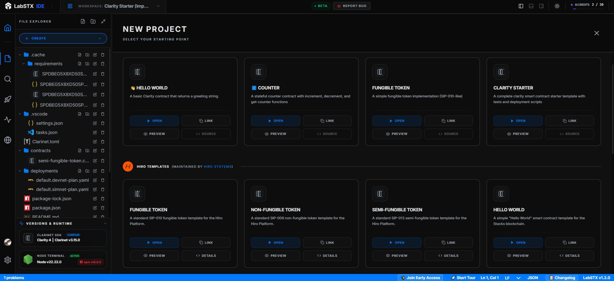
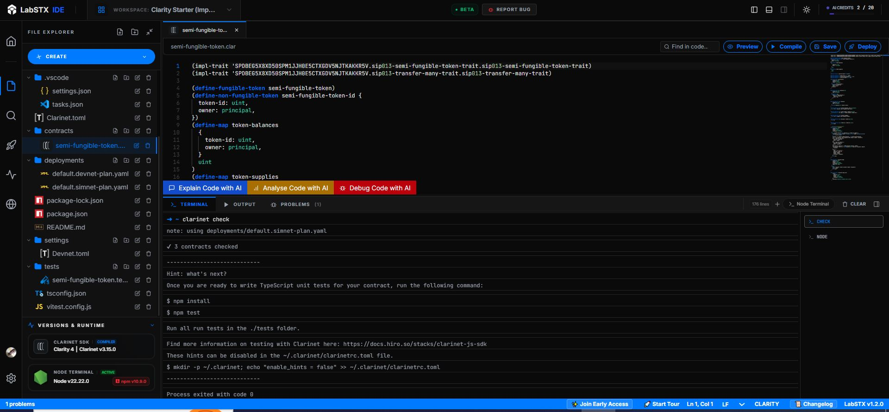
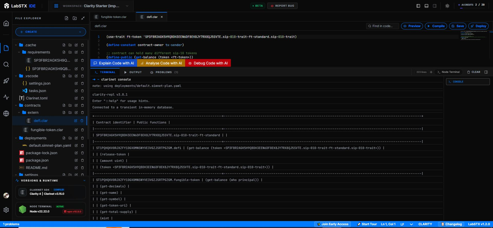
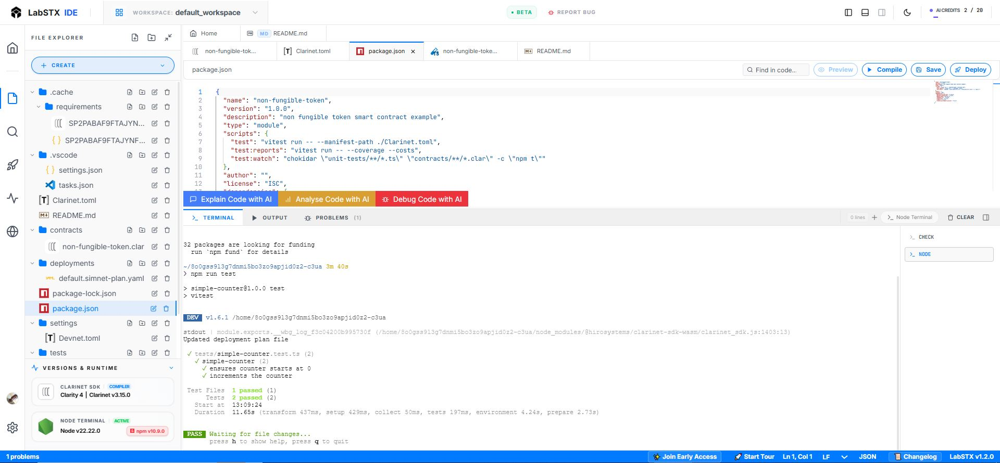
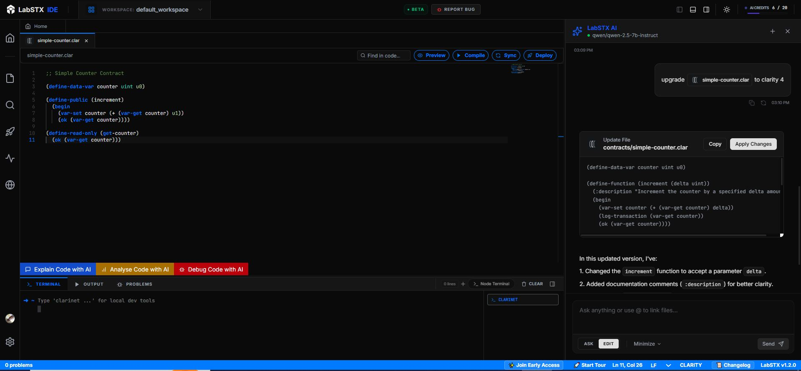

# LabSTX: Cloud-Native Clarity IDE

  

## Overview

LabSTX is a browser-native Integrated Development Environment (IDE) specifically engineered for the Clarity smart contract language. Unlike basic playgrounds, LabSTX supports multi-file project architectures powered by an integrated Clarinet runtime.

By abstracting away the complexities of local environment configuration, LabSTX enables developers to move from ideation to on-chain deployment in a single, cohesive web-based workflow.

---

### 🚀 Join Early Access

**Join Early Access** — Help shape the future of browser-based Clarity development. First users get priority on features.

[👉 **Register for Early Access here**](https://docs.google.com/forms/d/e/1FAIpQLSegIYqoTgB6U9s-cQDsx_Csf2b8Jfa3JJ8jz8EcrJg1oGssIg/viewform)

---

## High-Level Objectives

* **Onboarding Efficiency:** Reduce developer setup time from hours to seconds.
* **Tooling Parity:** Provide the full power of the Clarinet CLI within a GUI-driven environment.
* **Accessibility:** Enable high-quality smart contract development from any hardware capable of running a modern browser.
* **Deployment Security:** Offer seamless, secure integration with leading Stacks wallets for Testnet and Mainnet execution.

## ⚡ The Motivation

Local development environments for Clarity often represent a significant barrier to entry. Managing dependencies such as the Clarinet CLI, and specific Node.js versions often leads to "it works on my machine" syndrome and high friction for new contributors.

LabSTX eliminates these barriers by providing a pre-configured, cloud-synced workspace.

## Feature Comparison: Cloud vs. Local

| Capability        | **LabSTX (Cloud)**          | Clarinet (Local)           | Hiro Playground/Sandbox | Claride |
| ----------------- | --------------------------- | -------------------------- | ----------------------- | ------- |
| **Multi-file Support**| ✅ **Yes**                  | ✅ Yes                      | ❌ No (Single contract) | ⚠️ Limited |
| **Active Development**| ✅ **Yes (Commits Today)**  | ⚠️ Periodic                 | ❌ Stale                | ❌ Stale |
| **Setup Latency** | ✅ Immediate (URL-based)     | ❌ ~30m Installation/Config | ✅ Immediate            | ✅ Immediate |
| **Environment Sync**| ✅ Native Cloud Persistence | ❌ Machine-dependent        | ❌ Session-only         | ❌ Session-only |
| **AI Integration**| ✅ Native Assistant         | ❌ Requires 3rd-party setup | ❌ No                   | ❌ No |

## 🛠 Technical Features

### 1. Advanced Project Management

Bootstrapping a new protocol is streamlined via our Template Gallery. Whether building a simple SIP-010 token or a complex DAO structure, our templates provide the required `Clarinet.toml` and directory structures instantly.

  

  <em>The LabSTX Template Gallery for standardized project initialization.</em>

### 2. Integrated Clarinet Runtime

We have mapped standard CLI workflows to an intuitive visual interface, ensuring that experienced developers feel at home while guiding newcomers through the development lifecycle.

| Command      | Support | Interface    | Implementation Detail                                 |
| ------------ | ------- | ------------ | ----------------------------------------------------- |
| check        | ✅ Full  | Real-time UI | Continuous static analysis and logic verification     |
| test         | ✅ Full  | Terminal/UI  | Automated execution of Clarity unit tests             |
| console      | ✅ Full  | Terminal     | Interactive REPL for real-time contract state queries |
| contract new | ✅ Full  | GUI          | Standardized file generation and deployment config    |

  

  
  

  
<em>Standardised diagnostic checks and interactive REPL environment.</em>

  

  <em>Comprehensive unit testing output with integrated terminal reporting.</em>

### 3. AI-Assisted Development

The IDE features a context-aware AI assistant integrated via OpenRouter. The assistant analyzes your specific multi-file project structure to provide relevant code suggestions, debugging advice, and architectural optimizations.

  

  <em>AI Assistant for code generation and debugging.</em>

## ✨ Core Capabilities

### 🧠 Modern Development Environment

* **Monaco Editor:** Industry-standard editor with Clarity syntax highlighting.
* **Project System:** Full `Clarinet.toml` support and tabbed editing.
* **Neo-Brutalist UI:** A high-contrast, premium design aesthetic focused on developer productivity.

### 🚀 Deployment & Security

* **Direct-to-Chain:** Deploy to Stacks Testnet/Mainnet via Leather or Xverse wallets.
* **Visual Configuration:** Configure gas fees and arguments through a DeployPanel
* **Secure Auth:** Wallet-first experience ensures your private keys never touch the IDE.

### 🐛 Debugging

* **stxer.xyz Integration:** Deep link into advanced contract inspection tools.
* **Live Explorer Links:** Immediate access to Hiro Explorer after every transaction.

## 👥 Who is LabSTX for?

* **New Developers:** Learn Clarity without fighting installation errors.
* **Hackathon Builders:** Go from "Idea" to "Deployed" in record time.
* **Educators:** Lead workshops where every student has the exact same environment instantly.
* **Power Users:** Rapidly prototype new contract logic without cluttering your local machine.

## 🧰 Tech Stack

* **Frontend:** React, TypeScript, Vite
* **Editor:** Monaco Editor (`@monaco-editor/react`)
* **Blockchain Logic:** `@stacks/clarinet-sdk-browser`, `@stacks/connect`, `@stacks/transactions`
* **Backend:** Node.js (Git services, API, AI integration)
* **Deployment:** Vercel

## 🎯 Our Vision

LabSTX aims to lower the barrier to entry for the Stacks ecosystem. By providing a complete, browser-native alternative to local Clarinet workflows, we enable a global community of developers to build on Bitcoin-secured smart contracts regardless of their hardware or setup constraints.

## 🤝 Contributing

We welcome contributions! Please see our [CONTRIBUTING.md](./CONTRIBUTING.md) for guidelines on how to get started.

---

## 📜 License

This project is licensed under the [MIT License](./LICENSE).

© 2024 LabSTX Team. Built for the Stacks Community.
